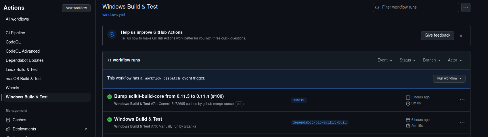

# Manual Workflows

Some of the CI workflow takes many minutes to complete and are not executed on every commit. Those are `Wheels` and `Windows Build&Test`.

It is possible to run them by going to actions tab at this project's gitHub repository. Then you have to find selected action in `All workflows` list.

There is also `CodeQL`, which runs on commits to master or can be triggered by hand.

*Appearance of the workflow menu*

Click chosen workflow and list of its runs should appear. On top of it you can find `Run workflow` button. Click it and select branch on which you want to run it. Tests fired manually do not appear on list of standard tests in the PR and won't appear there if failing.
